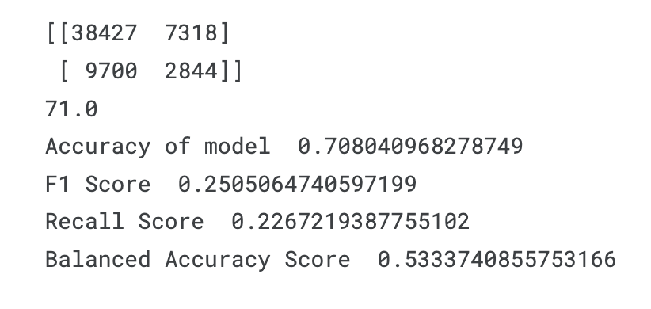

## Project description

This project explores the prediction of loan default status using a
machine learning classification approach. The notebook includes data
preprocessing, exploratory data analysis, feature engineering, and the
application of classification algorithms such as Logistic Regression and
Random Forest. The goal is to accurately classify whether a loan
applicant is likely to default, leveraging real-world financial data and
evaluating model performance through metrics like accuracy and confusion
matrix. The project provides insights into important predictive features
and demonstrates a practical workflow for tackling binary classification
problems in the financial domain.

## Table of contents

1.  [Data loading]
2.  [Preliminary Data Analysis]
3.  [Explanatory Data Analysis]
    -   [Class distribution]
    -   [Default vs. Disbursal date]
    -   [Outlier Treatment]
    -   [Univariate analysis]
    -   [Feature Selection]
        -   [Standardization of data]
        -   [Dummy insertion]
4.  [Modeling]
    -   [Logistic Regression]
    -   [Random Forest]
    -   [Naive Bayes]
    -   [Stochastic Gradient Descent]
    -   [Decision Tree Classifier]
    -   [XGBoost]
5.  [Dealing with Imbalanced Data]
    -   [SMOTE]
    -   [Upsampling]
    -   [Downsampling]
    -   [PCA]
6.  [Conclusions]

## Data loading

```{r}
knitr::opts_chunk$set(warning = FALSE, message = FALSE, cache=TRUE)
```

```{r setup, message=FALSE, error=TRUE}
install.packages(c("dplyr", "tidyr", "stringr", "formattable", "ggcorrplot", "ggplot2", "lubridate", "gridExtra", "readr", "scales", "fastDummies", "plotly", "reshape2", "randomForest", "caret", "RANN", "e1071", "MLmetrics", "xgboost", "DMwR2", "smotefamily", "glmnet", "rpart", "caTools", "progress", "stats"))

options(repos = c(CRAN = "https://cloud.r-project.org"))
library(dplyr)
library(tidyr)
library(stringr)
library(formattable)
library(ggcorrplot)
suppressWarnings({
  library(ggplot2)
  library(lubridate)
  library(gridExtra)
})
library(readr)
library(scales)
library(fastDummies)
library(plotly)
library(reshape2)
library(randomForest)
library(caret)
library(RANN)
library(e1071)
library(MLmetrics)
library(xgboost)
library(DMwR2) 
library(smotefamily)
library(glmnet)
library(rpart)
library(caTools)
library(progress)
library(stats)  
```

```{r}
train <- read_csv("train.csv")
test  <- read.csv("test.csv")
df    <- bind_rows(train, test)
```

## Preliminary Data Analysis

```{r, warning = FALSE, message = FALSE, cache=TRUE, class.output="bg-warning"}
cat("Shape of training dataframe: ", dim(train), "\n")
cat("Shape of testing dataframe: ", dim(test), "\n")

train <- train[!duplicated(train), ]
test <- test[!duplicated(test), ]

cat("Shape of training dataframe after removing duplicates: ", dim(train), "\n")
cat("Shape of testing dataframe after removing duplicates: ", dim(test), "\n")
```

```{r inspection Variable Inspection, warning = FALSE, message = FALSE, cache=TRUE, class.output="bg-warning"}
cat("Names of columns: ", colnames(train), "\n")
```

We have 41 variables, no duplicates were detected. Overall, we have over
230 thousand observations in our training set. Let's check whether the
dataset has any missing values.

```{r, warning = FALSE, message = FALSE, cache=TRUE, class.output="bg-warning"}
total <- nrow(train)
missing_data <- train %>%
  summarise(across(everything(), ~sum(is.na(.)))) %>%
  pivot_longer(everything(), names_to = "column name", values_to = "Total missing") %>%
  mutate(`Percent missing` = (`Total missing` / total) * 100) %>%
  arrange(desc(`Total missing`))
print(missing_data)
```

We can see that more that 3% of the 'EMPLOYMENT_TYPE' variable's values
is missing. We will treat the NA values as not employed.

```{r, warning = FALSE, message = FALSE, cache=TRUE}
print(unique(train$EMPLOYMENT_TYPE))
length(unique(train$EMPLOYMENT_TYPE))
```

Let's analyze the structure of the data set. We can see that most of the
variables are numeric. We see that 'AVERAGE_ACCT_AGE' and
'CREDIT_HISTORY_LENGHT' can be changed from characters to numbers.

```{r, warning = FALSE, message = FALSE, cache=TRUE}
str(train)
```

```{r, warning = FALSE, message = FALSE, cache=TRUE}
parse_age <- function(x) {
  years <- as.numeric(str_extract(x, "\\d+(?=yrs)"))
  months <- as.numeric(str_extract(x, "\\d+(?=mon)"))
  years[is.na(years)] <- 0
  months[is.na(months)] <- 0
  years + months / 12
}

train <- train %>%
  mutate(AVERAGE_ACCT_AGE = parse_age(AVERAGE_ACCT_AGE),
         CREDIT_HISTORY_LENGTH = parse_age(CREDIT_HISTORY_LENGTH))

test <- test %>%
  mutate(AVERAGE_ACCT_AGE = parse_age(AVERAGE_ACCT_AGE),
         CREDIT_HISTORY_LENGTH = parse_age(CREDIT_HISTORY_LENGTH))

```

Additionally, we changed the format of variables 'DATE_OF_BIRTH' and
'DISBURSAL_DATE' form object to date.

```{r, warning = FALSE, message = FALSE, cache=TRUE}
train$DATE_OF_BIRTH <- as.Date(train$DATE_OF_BIRTH, format = "%d-%m-%Y")
test$DATE_OF_BIRTH  <- as.Date(test$DATE_OF_BIRTH,  format = "%d-%m-%Y")

train$DISBURSAL_DATE <- as.Date(train$DISBURSAL_DATE, format = "%d-%m-%Y")
test$DISBURSAL_DATE  <- as.Date(test$DISBURSAL_DATE,  format = "%d-%m-%Y")
```

Finally, we obtained the dataset shaped like this:

```{r, warning = FALSE, message = FALSE, cache=TRUE, class.output="bg-warning"}
str(train)
```

## Explanatory Data Analysis

Now we can proceed with the EDA. Let's start with

### Class distribution

We will analyze the distribution of the target variable 'LOAN_DEFAULT'.

```{r, warning = FALSE, message = FALSE, cache=TRUE, class.source="bg-danger", class.output="bg-warning"}
class_df <- train %>%
  group_by(LOAN_DEFAULT) %>%
  summarise(UNIQUEID_count = n()) %>%
  arrange(desc(UNIQUEID_count))

formattable(class_df, list( UNIQUEID_count = color_bar("lightgreen") ))
```

```{r, warning = FALSE, message = FALSE, cache=TRUE, class.output="bg-warning"}
colors <- c("0" = "deepskyblue", "1" = "deeppink")

ggplot(train, aes(x = factor(LOAN_DEFAULT), fill = factor(LOAN_DEFAULT))) +
  geom_bar() +
  scale_fill_manual(values = colors) +
  labs(title = "Class Distribution", x = "Loan Default", y = "Count") +
  theme_minimal()

count_default_0 <- sum(train$LOAN_DEFAULT == 0, na.rm = TRUE)
count_default_1 <- sum(train$LOAN_DEFAULT == 1, na.rm = TRUE)
total <- count_default_0 + count_default_1

percentage_0 <- (count_default_0 / total) * 100
percentage_1 <- (count_default_1 / total) * 100

cat(sprintf("%% of no defaults       : %.2f%%\n", percentage_0))
cat(sprintf("Number of no defaults  : %d\n", count_default_0))
cat(sprintf("%% of defaults          : %.2f%%\n", percentage_1))
cat(sprintf("Number of defaults     : %d\n", count_default_1))
```

Also, let's analyze the distribution between other categorical
variables, such as 'EMPLOYMENT_TYPE', 'MOBILENO_AVL_FLAG',
'AADHAR_FLAG', 'PAN_FLAG', 'VOTERID_FLAG', 'DRIVING_FLAG' and
'PASSPORT_FLAG' **'EMPLOYMENT_TYPE'**

```{r, warning = FALSE, message = FALSE, cache=TRUE, class.output="bg-warning"}
train %>%
  group_by(EMPLOYMENT_TYPE, LOAN_DEFAULT) %>%
  summarise(count = n(), .groups = 'drop') %>%
  group_by(EMPLOYMENT_TYPE) %>%
  mutate(prop = count / sum(count)) %>%
  arrange(EMPLOYMENT_TYPE, LOAN_DEFAULT) %>%
  print(n = Inf)
```

**'MOBILENO_AVL_FLAG'**

```{r, warning = FALSE, message = FALSE, cache=TRUE, class.output="bg-warning"}
train %>%
  group_by(MOBILENO_AVL_FLAG, LOAN_DEFAULT) %>%
  summarise(count = n(), .groups = 'drop') %>%
  group_by(MOBILENO_AVL_FLAG) %>%
  mutate(percentage = count / sum(count)) %>%
  print()
```

**'AADHAR_FLAG'**

```{r, warning = FALSE, message = FALSE, cache=TRUE, class.output="bg-warning"}
train %>%
  group_by(AADHAR_FLAG, LOAN_DEFAULT) %>%
  summarise(count = n(), .groups = 'drop') %>%
  group_by(AADHAR_FLAG) %>%
  mutate(percentage = count / sum(count)) %>%
  print()
```

\***'PAN_FLAG'**

```{r, warning = FALSE, message = FALSE, cache=TRUE, class.output="bg-warning"}
train %>%
  group_by(PAN_FLAG, LOAN_DEFAULT) %>%
  summarise(count = n(), .groups = 'drop') %>%
  group_by(PAN_FLAG) %>%
  mutate(percentage = count / sum(count)) %>%
  print()
```

**'VOTERID_FLAG'**

```{r, warning = FALSE, message = FALSE, cache=TRUE, class.output="bg-warning"}
train %>%
  group_by(VOTERID_FLAG, LOAN_DEFAULT) %>%
  summarise(count = n(), .groups = 'drop') %>%
  group_by(VOTERID_FLAG) %>%
  mutate(percentage = count / sum(count)) %>%
  print()
```

**'DRIVING_FLAG'**

```{r, warning = FALSE, message = FALSE, cache=TRUE, class.output="bg-warning"}
train %>%
  group_by(DRIVING_FLAG, LOAN_DEFAULT) %>%
  summarise(count = n(), .groups = 'drop') %>%
  group_by(DRIVING_FLAG) %>%
  mutate(percentage = count / sum(count)) %>%
  print()
```

**'PASSPORT_FLAG'**

```{r, warning = FALSE, message = FALSE, cache=TRUE, class.output="bg-warning"}
train %>%
  group_by(PASSPORT_FLAG, LOAN_DEFAULT) %>%
  summarise(count = n(), .groups = 'drop') %>%
  group_by(PASSPORT_FLAG) %>%
  mutate(percentage = count / sum(count)) %>%
  print()
```

**Combined**

```{r, warning = FALSE, message = FALSE, cache=TRUE, class.output="bg-warning"}
train %>%
  group_by(LOAN_DEFAULT, EMPLOYMENT_TYPE, AADHAR_FLAG, PAN_FLAG, DRIVING_FLAG, PASSPORT_FLAG, VOTERID_FLAG) %>%
  summarise(count = n(), .groups = 'drop') %>%
  arrange(desc(count)) %>%
  print()
```

We can observe that the distribution between defaulted and non-defaulted
client across all analyzed variables fluctuates around 21/79.

### Default vs. Disbursal date

```{r, warning = FALSE, message = FALSE, cache=TRUE, class.source="bg-danger", class.output="bg-warning"}
train$LOAN_DEFAULT <- as.factor(train$LOAN_DEFAULT)

ggplot(train, aes(x = DISBURSAL_DATE, fill = LOAN_DEFAULT)) +
  geom_histogram(data = subset(train, LOAN_DEFAULT == 1), 
                 bins = 50, alpha = 0.8, fill = "deeppink") +
  geom_histogram(data = subset(train, LOAN_DEFAULT == 0), 
                 bins = 50, alpha = 0.8, fill = "deepskyblue") +
  facet_wrap(~LOAN_DEFAULT, ncol = 1, scales = "free_y",
             labeller = as_labeller(c(`0` = "No default", `1` = "Default"))) +
  labs(x = "DISBURSAL DATE", y = "Number of Loans") +
  theme_bw() +
  theme(legend.position = "none")
```

### Outlier Treatment

First let's define a couple of useful functions that will help us
quickly perform univariate analysis.

```{r}
# Plot distribution of one feature

plot_distribution <- function(feature, color = "steelblue") {
ggplot(train, aes_string(x = feature)) + geom_histogram(aes(y =
..density..), fill = color, bins = 100, alpha = 0.7, na.rm = TRUE) +
geom_density(color = "black", size = 1, na.rm = TRUE) + labs(title =
paste("Distribution of", feature), x = feature, y = "Density") +
theme_minimal() }
```

```{r}
# Plot distribution bar plot of several features
plot_bar_comp <- function(var, nrow = 2) {
  plot_list <- list()
  
  for (feature in var) {
    p <- ggplot(train, aes_string(x = feature)) +
      geom_bar(fill = "skyblue") +
      labs(x = feature, y = "Count plot") +
      theme_minimal(base_size = 12)
    plot_list[[length(plot_list) + 1]] <- p
  }
  
  ncol <- 2
  do.call(grid.arrange, c(plot_list, nrow = nrow, ncol = ncol))
}
```

```{r}
# Plot distribution plot of several features
plot_distribution_comp <- function(data, variables, n_rows = 3, n_cols = 2) {
  plot_list <- list()
  
  for (var in variables) {
    # Check if variable has very large values that need scientific notation
    scientific <- max(data[[var]], na.rm = TRUE) > 1e6
    
    p <- ggplot(data, aes_string(x = var, color = "factor(LOAN_DEFAULT)", 
                                 fill = "factor(LOAN_DEFAULT)")) +
      geom_density(alpha = 0.2) +
      scale_color_manual(name = "",
                       values = c("0" = "blue", "1" = "red"),
                       labels = c("LOAN_DEFAULT = 0", "LOAN_DEFAULT = 1")) +
      scale_fill_manual(name = "",
                       values = c("0" = "blue", "1" = "red"),
                       labels = c("LOAN_DEFAULT = 0", "LOAN_DEFAULT = 1")) +
      labs(x = var, y = "Density plot") +
      theme_bw() +
      theme(panel.grid.major = element_line(color = "grey90"),
            panel.grid.minor = element_line(color = "grey90"),
            legend.position = "bottom",
            legend.box = "horizontal",
            plot.title = element_text(size = 11))
    
    # Use scientific notation for large value variables
    if (scientific) {
      p <- p + scale_x_continuous(labels = scientific_format())
    }
    
    plot_list[[length(plot_list) + 1]] <- p
  }
  
  # Arrange all plots in a grid
  grid.arrange(grobs = plot_list, nrow = n_rows, ncol = n_cols)
}
```

```{r}
# Box Plot for one feature
plot_box <- function(feature, color = "skyblue") { ggplot(train,
aes_string(y = feature)) + geom_boxplot(fill = color, outlier.color =
"red", na.rm = TRUE) + labs(title = paste("Box Plot of", feature), y =
feature) + theme_minimal() }
```

```{r}
# Bar Plot for one feature
plot_bar <- function(feature) { ggplot(train, aes_string(y = feature,
fill = "factor(LOAN_DEFAULT)")) + geom_bar(position = "dodge", color =
"black") + scale_fill_manual(values = c("0" = "skyblue", "1" = "pink"),
name = "LOAN_DEFAULT", labels = c("No Default", "Default")) + labs(title
= paste("Bar Plot of", feature, "by Loan Default"), y = feature, x =
"Count") + theme_minimal() + theme( axis.text.y = element_text(size =
10), plot.title = element_text(size = 14, face = "bold") ) }
```

Now, let's analyze important explanatory variable:
**'DISBURSED_AMOUNT'**.

```{r, warning = FALSE, message = FALSE, cache=TRUE, class.output="bg-warning"}
summary(train$DISBURSED_AMOUNT)

plot_distribution("DISBURSED_AMOUNT", "green")

plot_box("DISBURSED_AMOUNT", "green")
```

Based on the box plot, we can observe the presence of the outliers. We
will try two methods of dealing with outliers: replacing the outliers'
values with a sample mean and binning. But first, let's define functions
that will speed up the outlier detection process. We will create a
function that will calculate all necessary statistical values: mean,
lower and upper threshold.

```{r}
outlier_data <- function(df, feature) {
  # Number of observations
  obs <- length(df[[feature]])
  cat("No. of observations in column:", obs, "\n")
  
  # Descriptive statistics
  data_mean <- mean(df[[feature]], na.rm = TRUE)
  data_sd   <- sd(df[[feature]], na.rm = TRUE)
  cat(sprintf("Statistics: Mean = %.3f, Std dev = %.3f\n", data_mean, data_sd))
  
  # Thresholds for outliers, set as 3 standard deviations
  cut_off <- data_sd * 3
  lower <- data_mean - cut_off
  upper <- data_mean + cut_off
  
  # Outliers count
  outliers <- df[[feature]][df[[feature]] < lower | df[[feature]] > upper]
  cat("Identified outliers:", length(outliers), "\n")
  
  return(list(lower = lower, upper = upper, mean = data_mean))
}
```

Now, let's play with smoothing the outliers. We will create the function
that will impute the outstanding obseravtions.

```{r}
impute_outlier <- function(vec, lower, upper, mean_val) {
  sapply(vec, function(x) {
    if (is.na(x)) {
      return(NA)
    } else if (x <= lower || x >= upper) {
      return(mean_val)
    } else {
      return(x)
    }
  })
}
```

```{r, warning = FALSE, message = FALSE, cache=TRUE, class.output="bg-warning"}
disbursed_amount_stats <- outlier_data(train, 'DISBURSED_AMOUNT')
```

We manage to identify more that 3000 outliers. Now we will replace the
values with the mean.

```{r, warning = FALSE, message = FALSE, cache=TRUE, class.output="bg-warning"}
train$DISBURSED_AMOUNT_new <- impute_outlier(train$DISBURSED_AMOUNT, disbursed_amount_stats$lower, disbursed_amount_stats$upper, disbursed_amount_stats$mean)

# No. of observations after the imputation
cat("No. of observations in column: ", length(train$DISBURSED_AMOUNT_new), "\n")
```

Now let's try binning. Firstly, we have too divide our variable's range
into bins. We chose to divide it to 4 bins based on quantiles.

```{r, warning = FALSE, message = FALSE, cache=TRUE, class.output="bg-warning"}
bin_labels <- c("Low", "Medium", "High", "Extreme")

quantiles <- quantile(train$DISBURSED_AMOUNT, probs = c(0, 0.25, 0.5, 0.75, 1), na.rm = TRUE)

# Quantile distribution
train$DISBURSED_AMOUNT_bins <- cut(train$DISBURSED_AMOUNT,
                                   breaks = quantiles,
                                   include.lowest = TRUE,
                                   labels = bin_labels)

table(train$DISBURSED_AMOUNT_bins)

plot_bar("DISBURSED_AMOUNT_bins")
```

Now let's analyze another variable: **'ASSET_COST'**

```{r, warning = FALSE, message = FALSE, cache=TRUE, class.output="bg-warning"}
summary(train$ASSET_COST)
plot_distribution <- function(feature, color = "steelblue") {
  ggplot(train, aes_string(x = feature)) +
    geom_histogram(aes(y = ..density..), fill = color, bins = 100, alpha = 0.7, na.rm = TRUE) +
    geom_density(color = "black", size = 1, na.rm = TRUE) +
    labs(title = paste("Distribution of", feature), x = feature, y = "Density") +
    theme_minimal()
}
plot_distribution("ASSET_COST", "tomato")
plot_box("ASSET_COST", "tomato")
```

Again, we can notice the presence of the outliers. We can apply similar
approach as before.

Imputation

```{r, warning = FALSE, message = FALSE, cache=TRUE, class.output="bg-warning"}
asset_cost_stats <- outlier_data(train, 'ASSET_COST')
```

Almost 4500 outliers detected - let's try smoothing them out with mean

```{r, warning = FALSE, message = FALSE, cache=TRUE, class.output="bg-warning"}
train$ASSET_COST_new <- impute_outlier(train$ASSET_COST, asset_cost_stats$lower, asset_cost_stats$upper, asset_cost_stats$mean)

# No. of observations after the imputation

cat("No. of observations in column: ", length(train$ASSET_COST_new), "\n")
```

Binning

```{r, warning = FALSE, message = FALSE, cache=TRUE, class.output="bg-warning"}
quantiles <- quantile(train$ASSET_COST, probs = c(0, 0.25, 0.5, 0.75, 1), na.rm = TRUE)

#Quantile distribution
train$ASSET_COST_bins <- cut(train$ASSET_COST,
                                   breaks = quantiles,
                                   include.lowest = TRUE,
                                   labels = bin_labels)

table(train$ASSET_COST_bins)

plot_bar("ASSET_COST_bins")
```

**'LTV'**

```{r, warning = FALSE, message = FALSE, cache=TRUE, class.output="bg-warning"}
summary(train$LTV)
plot_distribution <- function(feature, color = "steelblue") {
  ggplot(train, aes_string(x = feature)) +
    geom_histogram(aes(y = ..density..), fill = color, bins = 100, alpha = 0.7, na.rm = TRUE) +
    geom_density(color = "black", size = 1, na.rm = TRUE) +
    labs(title = paste("Distribution of", feature), x = feature, y = "Density") +
    theme_minimal()
}
plot_distribution("LTV", "tomato")
plot_box("LTV", "tomato")
```

Imputation

```{r, warning = FALSE, message = FALSE, cache=TRUE, class.output="bg-warning"}
LTV_stats <- outlier_data(train, 'LTV')
```

```{r, warning = FALSE, message = FALSE, cache=TRUE, class.output="bg-warning"}
train$LTV_new <- impute_outlier(train$LTV, LTV_stats$lower, LTV_stats$upper, LTV_stats$mean)

# No. of observations after the imputation

cat("No. of observations in column: ", length(train$LTV_new), "\n")
```

Binning

```{r, warning = FALSE, message = FALSE, cache=TRUE, class.output="bg-warning"}
quantiles <- quantile(train$LTV, probs = c(0, 0.25, 0.5, 0.75, 1), na.rm = TRUE)

#Quantile distribution
train$LTV_bins <- cut(train$LTV,
                                   breaks = quantiles,
                                   include.lowest = TRUE,
                                   labels = bin_labels)

table(train$LTV_bins)

plot_bar("LTV_bins")
```

**'PERFORM_CNS_SCORE'**

```{r, warning = FALSE, message = FALSE, cache=TRUE, class.output="bg-warning"}
summary(train$PERFORM_CNS_SCORE)
plot_distribution <- function(feature, color = "steelblue") {
  ggplot(train, aes_string(x = feature)) +
    geom_histogram(aes(y = ..density..), fill = color, bins = 100, alpha = 0.7, na.rm = TRUE) +
    geom_density(color = "black", size = 1, na.rm = TRUE) +
    labs(title = paste("Distribution of", feature), x = feature, y = "Density") +
    theme_minimal()
}
plot_distribution("PERFORM_CNS_SCORE", "tomato")
plot_box("PERFORM_CNS_SCORE", "tomato")
```

Imputation

```{r, warning = FALSE, message = FALSE, cache=TRUE, class.output="bg-warning"}
perform_cns_score_stats <- outlier_data(train, 'PERFORM_CNS_SCORE')
```

```{r, warning = FALSE, message = FALSE, cache=TRUE, class.output="bg-warning"}
train$PERFORM_CNS_SCORE_new <- impute_outlier(train$PERFORM_CNS_SCORE, perform_cns_score_stats$lower, perform_cns_score_stats$upper, perform_cns_score_stats$mean)

# No. of observations after the imputation

cat("No. of observations in column: ", length(train$PERFORM_CNS_SCORE_new), "\n")
```

Binning

```{r, warning = FALSE, message = FALSE, cache=TRUE, class.output="bg-warning"}
bin_labels = c("No History",'Very Low', "Low" ,'Medium', 'High')
cut_bins = c(-1,10,150, 350, 650, 1000)

quantiles <- quantile(train$PERFORM_CNS_SCORE, probs = c(0, 0.25, 0.5, 0.75, 1), na.rm = TRUE)

#Quantile distribution
train$PERFORM_CNS_SCORE_bins <- cut(train$PERFORM_CNS_SCORE,
                                   breaks = cut_bins,
                                   include.lowest = TRUE,
                                   labels = bin_labels)

table(train$PERFORM_CNS_SCORE_bins)

plot_bar("PERFORM_CNS_SCORE_bins")
```

**'PERFORM_CNS_SCORE_DESCRIPTION'**

```{r, warning = FALSE, message = FALSE, cache=TRUE, class.output="bg-warning"}
train %>%
  group_by(PERFORM_CNS_SCORE_DESCRIPTION, PERFORM_CNS_SCORE_bins) %>%
  summarise(count = n(), .groups = "drop") %>%
  arrange(desc(count))

table(train$PERFORM_CNS_SCORE_DESCRIPTION)

gg <- train %>%
  group_by(PERFORM_CNS_SCORE_DESCRIPTION, LOAN_DEFAULT) %>%
  summarise(counts = n(), .groups = "drop") %>%
  group_by(PERFORM_CNS_SCORE_DESCRIPTION) %>%
  mutate(percentage = counts / sum(counts) * 100) %>%
  ungroup()

print(gg)
```

**'PRI_NO_OF_ACCTS'**

```{r, warning = FALSE, message = FALSE, cache=TRUE, class.output="bg-warning"}
summary(train$PRI_NO_OF_ACCTS)
plot_distribution <- function(feature, color = "steelblue") {
  ggplot(train, aes_string(x = feature)) +
    geom_histogram(aes(y = ..density..), fill = color, bins = 100, alpha = 0.7, na.rm = TRUE) +
    geom_density(color = "black", size = 1, na.rm = TRUE) +
    labs(title = paste("Distribution of", feature), x = feature, y = "Density") +
    theme_minimal()
}
plot_distribution("PRI_NO_OF_ACCTS", "tomato")
plot_box("PRI_NO_OF_ACCTS", "tomato")
```

Imputation

```{r, warning = FALSE, message = FALSE, cache=TRUE, class.output="bg-warning"}
pri_no_of_accts_stats <- outlier_data(train, 'PRI_NO_OF_ACCTS')
```

```{r, warning = FALSE, message = FALSE, cache=TRUE, class.output="bg-warning"}
train$PRI_NO_OF_ACCTS_new <- impute_outlier(train$PRI_NO_OF_ACCTS, pri_no_of_accts_stats$lower, pri_no_of_accts_stats$upper, pri_no_of_accts_stats$mean)

# No. of observations after the imputation

cat("No. of observations in column: ", length(train$PRI_NO_OF_ACCTS_new), "\n")
```

Binning

```{r, warning = FALSE, message = FALSE, cache=TRUE, class.output="bg-warning"}
bin_labels <- c("One", "More than One")
cut_bins <- c(-1, 1, 1000)

train$PRI_NO_OF_ACCTS_bins <- cut(train$PRI_NO_OF_ACCTS,
                                   breaks = cut_bins,
                                   include.lowest = TRUE,
                                   labels = bin_labels)

table(train$PRI_NO_OF_ACCTS_bins)

plot_bar("PRI_NO_OF_ACCTS_bins")
```

**'PRI_OVERDUE_ACCTS'**

```{r, warning = FALSE, message = FALSE, cache=TRUE, class.output="bg-warning"}
summary(train$PRI_OVERDUE_ACCTS)
plot_distribution <- function(feature, color = "steelblue") {
  ggplot(train, aes_string(x = feature)) +
    geom_histogram(aes(y = ..density..), fill = color, bins = 100, alpha = 0.7, na.rm = TRUE) +
    geom_density(color = "black", size = 1, na.rm = TRUE) +
    labs(title = paste("Distribution of", feature), x = feature, y = "Density") +
    theme_minimal()
}
plot_distribution("PRI_OVERDUE_ACCTS", "tomato")
plot_box("PRI_OVERDUE_ACCTS", "tomato")
```

Imputation

```{r, warning = FALSE, message = FALSE, cache=TRUE, class.output="bg-warning"}
pri_overdue_accts_stats <- outlier_data(train, 'PRI_OVERDUE_ACCTS')
```

```{r, warning = FALSE, message = FALSE, cache=TRUE, class.output="bg-warning"}
train$PRI_OVERDUE_ACCTS_new <- impute_outlier(train$PRI_OVERDUE_ACCTS, pri_overdue_accts_stats$lower, pri_overdue_accts_stats$upper, pri_overdue_accts_stats$mean)

# No. of observations after the imputation

cat("No. of observations in column: ", length(train$PRI_OVERDUE_ACCTS_new), "\n")
```

Binning

```{r, warning = FALSE, message = FALSE, cache=TRUE, class.output="bg-warning"}
bin_labels <- c("None", "One (or more)")
cut_bins <- c(-1, 0, 1000)

train$PRI_OVERDUE_ACCTS_bins <- cut(train$PRI_OVERDUE_ACCTS,
                                   breaks = cut_bins,
                                   include.lowest = TRUE,
                                   labels = bin_labels)

table(train$PPRI_OVERDUE_ACCTS_bins)

plot_bar("PRI_OVERDUE_ACCTS_bins")
```

Let's look into data with lesser importance

```{r, warning = FALSE, message = FALSE, cache=TRUE, class.output="bg-warning"}
var <- c("MOBILENO_AVL_FLAG", "AADHAR_FLAG", "PAN_FLAG", "VOTERID_FLAG", "PASSPORT_FLAG", "DRIVING_FLAG")
plot_bar_comp(var, nrow = 3)
```

## Univariate Analysis

**'EMPLOYMENT_TYPE'**

```{r, warning = FALSE, message = FALSE, cache=TRUE, class.output="bg-warning"}
ggplot(train, aes(x = EMPLOYMENT_TYPE, fill = factor(LOAN_DEFAULT))) +
geom_bar(position = "dodge", color = "black") + labs(title =
"EMPLOYMENT_TYPE vs LOAN_DEFAULT", x = "Employment Type", y = "Count",
fill = "Loan Default") + theme_minimal() + scale_fill_manual(values =
c("0" = "skyblue", "1" = "tomato"))
```

**Age is in days**

```{r, warning = FALSE, message = FALSE, cache=TRUE, class.output="bg-warning"}
now <- Sys.Date()
train$DATE_OF_BIRTH <- as.Date(train$DATE_OF_BIRTH, format = "%d-%m-%Y")

# Calculate age in days
train$age <- as.numeric(difftime(now, train$DATE_OF_BIRTH, units = "days"))

# Print first few ages
print(head(train$age))
```

```{r, warning = FALSE, message = FALSE, cache=TRUE, class.output="bg-warning"}
train$disbursal_time <- as.numeric(difftime(now, train$DISBURSAL_DATE, units = "days"))
head(train$disbursal_time)
```

**'MANUFACTURER_ID'**

```{r, warning = FALSE, message = FALSE, cache=TRUE, class.output="bg-warning"}
ggplot(train, aes(x = factor(MANUFACTURER_ID), fill = factor(LOAN_DEFAULT))) +
  geom_bar(position = "dodge", color = "black") +
  labs(title = "MANUFACTURER_ID vs LOAN_DEFAULT",
       x = "MANUFACTURER_ID",
       y = "Count",
       fill = "Loan Default") +
  scale_fill_manual(values = c("0" = "skyblue", "1" = "tomato"),
                    labels = c("No Default", "Default")) +
  theme_minimal() +
  theme(axis.text.x = element_text(angle = 45, hjust = 1))
```

**'BRANCH_ID'**

```{r, warning = FALSE, message = FALSE, cache=TRUE, class.output="bg-warning"}
ggplot(train, aes(x = factor(BRANCH_ID), fill = factor(LOAN_DEFAULT))) +
  geom_bar(position = "dodge", color = "black") +
  labs(title = "BRANCH_ID vs LOAN_DEFAULT",
       x = "BRANCH_ID",
       y = "Count",
       fill = "Loan Default") +
  scale_fill_manual(values = c("0" = "skyblue", "1" = "tomato"),
                    labels = c("No Default", "Default")) +
  theme_minimal() +
  theme(axis.text.x = element_text(angle = 45, hjust = 1))
```

```{r, warning = FALSE, message = FALSE, cache=TRUE, class.output="bg-warning"}
var <- c("PRI_NO_OF_ACCTS_new", "PRI_ACTIVE_ACCTS", "PRI_OVERDUE_ACCTS_new",
         "PRI_CURRENT_BALANCE", "PRI_SANCTIONED_AMOUNT", "PRI_DISBURSED_AMOUNT")

plot_distribution_comp(train, var)
```

Let's see the new columns along with the less important continous
variables

```{r, warning = FALSE, message = FALSE, cache=TRUE, class.output="bg-warning"}
var <- c("SEC_NO_OF_ACCTS", "SEC_ACTIVE_ACCTS", "SEC_OVERDUE_ACCTS",
"SEC_CURRENT_BALANCE", "SEC_SANCTIONED_AMOUNT", "SEC_DISBURSED_AMOUNT")

plot_distribution_comp(train, var)
```

## Feature Selection

Now we will proceed with the feature selection. First, we will drop the
variables that won't be used in our model.

```{r, warning = FALSE, message = FALSE, cache=TRUE, class.output="bg-warning"}
train <- train %>%
  select(-DATE_OF_BIRTH, -STATE_ID, -EMPLOYEE_CODE_ID,
         -SUPPLIER_ID, -MANUFACTURER_ID, -CURRENT_PINCODE_ID, -BRANCH_ID)
```

Now, let's calucate the correlation matrix to see which features are
correlated with each other in order to decrease a number of used
variables.

```{r, warning = FALSE, message = FALSE, cache=TRUE, class.source="bg-danger", class.output="bg-warning"}
corr_cols <- c("PRI_ACTIVE_ACCTS", "PRI_CURRENT_BALANCE",
"PRI_SANCTIONED_AMOUNT", "PRI_DISBURSED_AMOUNT", "SEC_NO_OF_ACCTS",
"SEC_ACTIVE_ACCTS", "SEC_OVERDUE_ACCTS", "SEC_CURRENT_BALANCE",
"SEC_SANCTIONED_AMOUNT", "SEC_DISBURSED_AMOUNT", "PRI_NO_OF_ACCTS_new",
"PRI_OVERDUE_ACCTS_new")

corr_data <- train[, corr_cols]

corr_matrix <- cor(corr_data, use = "pairwise.complete.obs")

corr_melted <- melt(corr_matrix)

# Create interactive heatmap
plot_ly(data = corr_melted,
        x = ~Var1,
        y = ~Var2,
        z = ~value,
        zmin = -1,              
        zmax = 1,
        type = "heatmap",
        colors = colorRamp(c("steelblue", "white", "darkgreen")))
```

Not highly correlated with anyone: 'PRI_ACTIVE_ACCTS',
'PRI_CURRENT_BALANCE','PRI_SANCTIONED_AMOUNT',
'PRI_DISBURSED_AMOUNT','SEC_OVERDUE_ACCTS'.

'PRI_NO_OF_ACCTS_new','PRI_OVERDUE_ACCTS_new' are perfectly positively
correlated and hence we are keeping only one.

'SEC_NO_OF_ACCTS', 'SEC_ACTIVE_ACCTS' are highly positively correlated,
hence we are keeping only one.

'SEC_CURRENT_BALANCE', 'SEC_SANCTIONED_AMOUNT', 'SEC_DISBURSED_AMOUNT'
are highly positively correlated, hence we are keeping only one.

```{r}
train <- train %>%
  select(-PRI_OVERDUE_ACCTS_new, -SEC_ACTIVE_ACCTS, -SEC_SANCTIONED_AMOUNT, -SEC_DISBURSED_AMOUNT)
```

Now let's analyze other variables.

```{r, warning = FALSE, message = FALSE, cache=TRUE, class.source="bg-danger", class.output="bg-warning"}
corr_data <- train[, c('SEC_INSTAL_AMT',
'PERFORM_CNS_SCORE','NEW_ACCTS_IN_LAST_SIX_MONTHS',
'DELINQUENT_ACCTS_IN_LAST_SIX_MONTHS', 'AVERAGE_ACCT_AGE',
'CREDIT_HISTORY_LENGTH', 'NO_OF_INQUIRIES','age', 'disbursal_time')]

corr_matrix <- cor(corr_data, use = "pairwise.complete.obs")

corr_melted <- melt(corr_matrix)

# Create interactive heatmap
plot_ly(data = corr_melted,
        x = ~Var1,
        y = ~Var2,
        z = ~value,
        zmin = -1,            
        zmax = 1,
        type = "heatmap",
        colors = colorRamp(c("steelblue", "white", "darkgreen")))
```

'AVERAGE_ACCT_AGE', 'CREDIT_HISTORY_LENGTH' are highly positively
correlated and hence we are keeping only one.

```{r}
train <- train %>%
  select(-AVERAGE_ACCT_AGE)
```

```{r, warning = FALSE, message = FALSE, cache=TRUE, class.source="bg-danger", class.output="bg-warning"}
corr_data <- train[, c('PRI_ACTIVE_ACCTS', 'PRI_CURRENT_BALANCE',
'PRI_SANCTIONED_AMOUNT', 'PERFORM_CNS_SCORE', 'PRI_DISBURSED_AMOUNT',
'SEC_NO_OF_ACCTS', 'SEC_OVERDUE_ACCTS', 'SEC_CURRENT_BALANCE',
'PRIMARY_INSTAL_AMT', 'SEC_INSTAL_AMT', 'NEW_ACCTS_IN_LAST_SIX_MONTHS',
'DELINQUENT_ACCTS_IN_LAST_SIX_MONTHS', 'CREDIT_HISTORY_LENGTH',
'NO_OF_INQUIRIES', 'DISBURSED_AMOUNT_new', 'ASSET_COST_new', 'LTV_new',
'PRI_NO_OF_ACCTS_new', 'age', 'disbursal_time')]

corr_matrix <- cor(corr_data, use = "pairwise.complete.obs")

corr_melted <- melt(corr_matrix)

# Create interactive heatmap
plot_ly(data = corr_melted,
        x = ~Var1,
        y = ~Var2,
        z = ~value,
        zmin = -1,            
        zmax = 1,
        type = "heatmap",
        colors = colorRamp(c("steelblue", "white", "darkgreen")))
```

Based on the correlation matrix we decided to: Choose one out of
'PRI_SANCTIONED_AMOUNT', 'PRI_DISBURSED_AMOUNT' Choose one out of
'LTV_new', 'PRI_NO_OF_ACCTS_new' And eliminate
'NEW_ACCTS_IN_LAST_SIX_MONTHS

```{r}
train <- train %>%
  select(-PRI_SANCTIONED_AMOUNT,-PRI_NO_OF_ACCTS_new,-NEW_ACCTS_IN_LAST_SIX_MONTHS)
```

Now we will prepare our data sets. One will contain only continuous
variables, with the outliers treated with imputation. Other will also
contain binned variables.

**Continuous Variables**

```{r}
train_con <- train[, c('EMPLOYMENT_TYPE', 'MOBILENO_AVL_FLAG',
'AADHAR_FLAG', 'PAN_FLAG', 'VOTERID_FLAG', 'DRIVING_FLAG',
'PASSPORT_FLAG', 'PERFORM_CNS_SCORE', 'PERFORM_CNS_SCORE_DESCRIPTION',
'PRI_ACTIVE_ACCTS', 'PRI_CURRENT_BALANCE', 'PRI_DISBURSED_AMOUNT',
'SEC_NO_OF_ACCTS', 'SEC_OVERDUE_ACCTS', 'SEC_CURRENT_BALANCE',
'PRIMARY_INSTAL_AMT', 'SEC_INSTAL_AMT',
'DELINQUENT_ACCTS_IN_LAST_SIX_MONTHS', 'CREDIT_HISTORY_LENGTH',
'NO_OF_INQUIRIES', 'LOAN_DEFAULT', 'DISBURSED_AMOUNT_new',
'ASSET_COST_new', 'LTV_new', 'age', 'disbursal_time')]
```

**Binned Variables**

```{r}
train_bin <- train[, c('UNIQUEID', 'EMPLOYMENT_TYPE',
'MOBILENO_AVL_FLAG', 'AADHAR_FLAG', 'PAN_FLAG', 'VOTERID_FLAG',
'DRIVING_FLAG', 'PASSPORT_FLAG', 'PERFORM_CNS_SCORE',
'PERFORM_CNS_SCORE_DESCRIPTION', 'PRI_ACTIVE_ACCTS',
'PRI_CURRENT_BALANCE', 'PRI_DISBURSED_AMOUNT', 'SEC_NO_OF_ACCTS',
'SEC_OVERDUE_ACCTS', 'SEC_CURRENT_BALANCE', 'PRIMARY_INSTAL_AMT',
'SEC_INSTAL_AMT', 'DELINQUENT_ACCTS_IN_LAST_SIX_MONTHS',
'CREDIT_HISTORY_LENGTH', 'NO_OF_INQUIRIES', 'LOAN_DEFAULT',
'DISBURSED_AMOUNT_bins', 'ASSET_COST_bins', 'LTV_bins',
'PERFORM_CNS_SCORE_bins', 'PRI_NO_OF_ACCTS_bins',
'PRI_OVERDUE_ACCTS_bins', 'age', 'disbursal_time')]
```

## Standardization of data

Let's transform some of the variables for better modelling.

```{r}
scaleColumns <- function(df, cols_to_scale) { 
  for (col in cols_to_scale) { 
    df[[col]] <- scale(df[[col]]) 
  } 
  return(df) 
  }
```

```{r, warning = FALSE, message = FALSE, cache=TRUE, class.source="bg-danger", class.output="bg-warning"}
scaled_df <- scaleColumns(train_con, c('PERFORM_CNS_SCORE',
'PRI_ACTIVE_ACCTS', 'PRI_CURRENT_BALANCE', 'PRI_DISBURSED_AMOUNT',
'SEC_NO_OF_ACCTS', 'SEC_OVERDUE_ACCTS', 'SEC_CURRENT_BALANCE',
'PRIMARY_INSTAL_AMT', 'SEC_INSTAL_AMT',
'DELINQUENT_ACCTS_IN_LAST_SIX_MONTHS', 'CREDIT_HISTORY_LENGTH',
'NO_OF_INQUIRIES', 'DISBURSED_AMOUNT_new', 'ASSET_COST_new', 'LTV_new',
'age', 'disbursal_time')
)

head(scaled_df)
```

## Dummy insertion

Let's turn the categorical variables into the dummy variables.

```{r, warning = FALSE, message = FALSE, cache=TRUE, class.source="bg-danger", class.output="bg-warning"}
train_dummy <- fastDummies::dummy_cols( scaled_df, remove_first_dummy = TRUE, remove_selected_columns = TRUE, ignore_na = TRUE)

head(train_dummy)
```

Finally, let's divide our modified dataset into a train and test set.

```{r, warning = FALSE, message = FALSE, cache=TRUE, class.output="bg-warning"}
y <- train_dummy["LOAN_DEFAULT_1"]

X <- train_dummy[, setdiff(names(train_dummy), "LOAN_DEFAULT_1")]

dim(y)
```

```{r, warning = FALSE, message = FALSE, cache=TRUE, class.output="bg-warning"}
set.seed(101) 
train_indices <- createDataPartition(y$LOAN_DEFAULT_1, p = 0.80, list = FALSE)

# Create training and testing datasets
X_train <- X[train_indices, ]
X_test <- X[-train_indices, ]
y_train <- y[train_indices, ]
y_test <- y[-train_indices, ]

k_fold <- trainControl(method = "cv", number = 10)
X_train$`EMPLOYMENT_TYPE_Self employed`[is.na(X_train$`EMPLOYMENT_TYPE_Self employed`)] <- 0
X_test$`EMPLOYMENT_TYPE_Self employed`[is.na(X_test$`EMPLOYMENT_TYPE_Self employed`)] <- 0
```

## Modeling

Now we can proceed to modeling. Firstly, we will define a couple of
functions that will help us in the modeling process.

```{r}
# Confusion Matrix
plot_confusion_matrix <- function(cm, classes, normalize = FALSE, title = "Confusion Matrix") {
  cm_df <- as.data.frame(cm) 
  colnames(cm_df) <- c("True", "Predicted","Freq")
  
  if (normalize) { 
    cm_df <- cm_df %>% 
      group_by(True) %>% 
      mutate(Freq = Freq / sum(Freq)) %>% 
      ungroup() 
    }
  max_val <- max(cm_df$Freq) 
  cm_df$text_color <- ifelse(cm_df$Freq > max_val / 2, "white", "black")
  
  decimals <- if(normalize) 2 else 0
  
  ggplot(cm_df, aes(x = Predicted, y = True, fill = Freq)) +
    geom_tile(color = "white") + 
    geom_text(aes(label = round(Freq, decimals), color = text_color), size = 4) +
    scale_fill_gradient(low = "white", high = "blue") +
    scale_color_identity() + 
    labs(title = title, x = "Predicted label", y = "True label") + 
    theme_minimal() 
}

```

```{r}
# Precision, Recall, F1 Score

show_metrics <- function(cm) { 
  cm <- as.matrix(cm)
  
  tn <- cm[1, 1] 
  fp <- cm[1, 2] 
  fn <- cm[2, 1] 
  tp <- cm[2, 2]
  
  precision <- tp / (tp + fp) 
  recall <- tp / (tp + fn) 
  f1_score <- 2 * ((precision * recall) / (precision + recall))
  
  cat(sprintf("Precision = %.3f\n", precision)) 
  cat(sprintf("Recall = %.3f\n", recall)) 
  cat(sprintf("F1_score = %.3f\n", f1_score)) 
}

```

```{r}
# Precision-recall curve

plot_precision_recall <- function(recall, precision) {
  df <- data.frame(recall = recall, precision = precision)
  
  ggplot(df, aes(x = recall, y = precision)) +
    geom_step(direction = "hv", alpha = 0.5, color = "blue") + 
    geom_ribbon(aes(ymin = 0, ymax = precision), alpha = 0.2, fill = "blue") +
    xlim(0.0, 1.0) + ylim(0.0, 1.05) +
    labs(title = "Precision-Recall Curve", x = "Recall", y = "Precision") +
    theme_minimal()
}

```

```{r}
# ROC curve

plot_roc <- function(fpr, tpr) { 
  df <- data.frame(fpr = fpr, tpr = tpr)
  
  ggplot(df, aes(x = fpr, y = tpr)) +
    geom_line(color = "blue", linewidth = 1.2) + 
    geom_abline(slope = 1, intercept = 0, linetype = "dashed", color= "black", linewidth = 1) + 
    xlim(0.0, 1.0) + ylim(0.0, 1.05) + 
    labs(title = "ROC Curve", x = "False Positive Rate", y = "True Positive Rate") +
    theme_minimal()
}

```

```{r}
#feature importance plot

plot_feature_importance <- function(model, predictors) { 
  tmp <- data.frame( Feature = predictors, Feature_importance = model$importance)
  tmp <- tmp[order(tmp$Feature_importance, decreasing = TRUE), ]
  
  ggplot(tmp, aes(x = reorder(Feature, Feature_importance), y =Feature_importance)) + 
    geom_bar(stat = "identity", fill = "steelblue") +
    coord_flip() + labs(title = "Features importance", x = "Feature", y ="Feature importance") + 
    theme_minimal() + theme(plot.title = element_text(size = 14)) 
  }
```

print(class(y_train))

## Logistic Regression

```{r}
print(class(y_train))
```

```{r, warning = FALSE, message = FALSE, cache=TRUE, class.output="bg-warning"}
if(is.list(y_train) && length(y_train) == 1) {
  y_train <- unlist(y_train)
}
logmodel <- glm(y_train ~ ., data = X_train, family = "binomial")

log_probs <- predict(logmodel, newdata = X_test, type = "response")
# For class predictions (equivalent to Python's predict):
logpred <- ifelse(log_probs > 0.5, 1, 0)
```

```{r, warning = FALSE, message = FALSE, cache=TRUE, class.output="bg-warning"}
# Print confusion matrix
if(is.data.frame(logpred)) {
  logpred <- as.vector(unlist(logpred))
}
if(is.list(y_test) && length(y_test) == 1) {
  y_test <- unlist(y_test)
}
```

```{r, warning = FALSE, message = FALSE, cache=TRUE, class.source="bg-danger", class.output="bg-warning"}
# Cross-validation
# Define k-fold cross-validation control
ctrl <- trainControl(method = "cv", number = 10)  # Assuming k_fold = 5 in your Python code

# Perform cross-validation
cv_model <- train(
  x = as.matrix(X_train),
  y = factor(y_train),
  method = "glm",
  family = "binomial",
  trControl = ctrl,
  metric = "Accuracy"
)

# Print cross-validated accuracy
LOGCV <- cv_model$results$Accuracy
print(paste0("Cross-validated accuracy: ", round(LOGCV * 100, 2), "%"))
```

```{r, warning = FALSE, message = FALSE, cache=TRUE, class.output="bg-warning"}
cm_log <- conf_matrix <- confusionMatrix(factor(logpred, levels = c(0,1)), factor(y_test, levels = c(0,1)))
saveRDS(cm_log, "cm_log.rds")

# Extract and print the metrics 
# Accuracy
cat("Accuracy of model", cm_log$overall["Accuracy"], "\n")
# F1 Score
cat("F1 Score", cm_log$byClass["F1"], "\n")
# Recall Score
cat("Recall Score", cm_log$byClass["Sensitivity"], "\n")
# Balanced Accuracy Score 
cat("Balanced Accuracy Score", cm_log$byClass["Balanced Accuracy"], "\n")
```

## Random Forest

```{r, warning = FALSE, message = FALSE, cache=TRUE, class.source="bg-danger", class.output="bg-warning"}
set.seed(42)  

if(!is.factor(y_train)) {
  y_train_factor <- factor(y_train)
} else {
  y_train_factor <- y_train
}

# Train the Random Forest model
rfc <- randomForest(
  x = X_train,             
  y = y_train_factor,      
  ntree = 10,               
  importance = TRUE         
)

# Predict on test set
rfc_pred <- predict(rfc, X_test)
```

```{r, warning = FALSE, message = FALSE, cache=TRUE, class.output="bg-warning"}
# Ensure factors have same levels for confusion matrix
y_test_factor <- factor(y_test)
rfc_pred_factor <- factor(rfc_pred, levels = levels(y_test_factor))

# Create confusion matrix and print it
cm_rf <- confusionMatrix(rfc_pred_factor, factor(y_test))
print(cm_rf$table)
saveRDS(cm_rf, "cm_rf.rds")

# Print results (equivalent to the Python code)
cat("Accuracy of model", cm_rf$overall["Accuracy"], "\n")
cat("F1 Score", cm_rf$byClass["F1"], "\n")
cat("Recall Score", cm_rf$byClass["Sensitivity"], "\n")
cat("Balanced Accuracy Score", cm_rf$byClass["Balanced Accuracy"], "\n")
```

## Naive Bayes

```{r, warning = FALSE, message = FALSE, cache=TRUE, class.output="bg-warning"}
nb_model <- naiveBayes(x = X_train, y = factor(y_train))

# Predict on test set

nb_pred <- predict(nb_model, newdata = X_test, type = "class")

# Ensure predictions and actual values are factors with consistent levels for confusion matrix
y_test_factor <- factor(y_test, levels = levels(nb_pred))

# Create confusion matrix and print it
cm_nb <- confusionMatrix(nb_pred, y_test_factor)
saveRDS(cm_nb, "cm_nb.rds")
print(cm_nb$table)

# Print accuracy as percentage
cat("Accuracy of model (Naive Bayes): ", round(cm_nb$overall["Accuracy"] * 100, 2), "%\n")
cat("F1 Score: ", cm_nb$byClass["F1"], "\n")
cat("Recall Score (Sensitivity): ", cm_nb$byClass["Sensitivity"], "\n")
cat("Balanced Accuracy Score: ", cm_nb$byClass["Balanced Accuracy"], "\n")

```

## Stochastic Gradient Descent

```{r, warning = FALSE, message = FALSE, cache=TRUE, class.source="bg-danger", class.output="bg-warning"}
set.seed(101)

# Preprocess y_train
if (is.list(y_train) || is.data.frame(y_train)) {
  y_train <- unlist(y_train)
}
y_train <- factor(y_train)
y_test <- factor(y_test, levels = levels(y_train))

k_fold <- 10
ctrl <- trainControl(method = "cv", number = k_fold, classProbs = FALSE, summaryFunction = defaultSummary)

# Train SGD model using caret with glmnet method (elastic net logistic regression, similar to SGD)
sgd_model <- train(
  x = X_train,
  y = y_train,
  method = "glmnet",
  trControl = ctrl,
  metric = "Accuracy"
)

# Predict on test data
sgd_pred <- predict(sgd_model, X_test)
```

```{r, warning = FALSE, message = FALSE, cache=TRUE, class.output="bg-warning"}
# Confusion Matrix
cm_sgd <- confusionMatrix(sgd_pred, y_test, positive = levels(y_test)[2])
saveRDS(cm_sgd, "cm_sgd.rds")
print(cm_sgd$table)

# Accuracy
accuracy <- cm_sgd$overall["Accuracy"]
cat("Accuracy of model:", round(accuracy * 100, 2), "%\n")

# F1 Score
f1 <- F1_Score(y_pred = sgd_pred, y_true = y_test, positive = levels(y_test)[2])
cat("F1 Score:", round(f1, 3), "\n")

# Recall (Sensitivity)
recall <- cm_sgd$byClass["Sensitivity"]
cat("Recall Score:", round(recall, 3), "\n")

# Balanced Accuracy
cat("Balanced Accuracy Score:", cm_sgd$byClass["Balanced Accuracy"], "\n")

# Cross-validated accuracy 
cv_accuracy <- max(sgd_model$results$Accuracy)
cat("Cross-validated accuracy:", round(cv_accuracy * 100, 2), "%\n")
```

## Decision Tree Classifier

```{r, warning = FALSE, message = FALSE, cache=TRUE, class.output="bg-warning"}
set.seed(101)

# Preprocess target variables
if (is.list(y_train) || is.data.frame(y_train)) {
  y_train <- unlist(y_train)
}
y_train <- factor(y_train)
y_test <- factor(y_test, levels = levels(y_train))

k_fold <- 10
ctrl <- trainControl(method = "cv", number = k_fold)

# Train Decision Tree model with parameters similar to sklearn
dtree_model <- train(
  x = X_train,
  y = y_train,
  method = "rpart",
  tuneGrid = data.frame(cp = 0),
  trControl = ctrl,
  control = rpart.control(maxdepth = 10, minbucket = 30, maxcompete = 0, maxsurrogate = 0)
)

# Predict on test set
dtree_pred <- predict(dtree_model, X_test)

# Confusion matrix
cm_dt <- confusionMatrix(dtree_pred, y_test, positive = levels(y_test)[2])
saveRDS(cm_dt, "cm_dt.rds")
print(cm_dt$table)

# Accuracy
accuracy <- cm_dt$overall["Accuracy"]
cat("Accuracy of model:", round(accuracy * 100, 2), "%\n")

# F1 Score
f1 <- F1_Score(y_pred = dtree_pred, y_true = y_test, positive = levels(y_test)[2])
cat("F1 Score:", round(f1, 3), "\n")

# Recall (Sensitivity)
recall <- cm_dt$byClass["Sensitivity"]
cat("Recall Score:", round(recall, 3), "\n")

# Balanced Accuracy
cat("Balanced Accuracy Score:", cm_dt$byClass["Balanced Accuracy"], "\n")

# Cross-validated accuracy (already done during train)
cv_accuracy <- max(dtree_model$results$Accuracy)
cat("Cross-validated accuracy:", round(cv_accuracy * 100, 2), "%\n")

```

## XGBoost

```{r}


train_with_progress_bar <- function(X_train, y_train, nrounds = 100) {
  # Convert data
  dtrain <- xgb.DMatrix(data = as.matrix(X_train), label = as.numeric(y_train) - 1)
  
  # Create progress bar
  pb <- progress_bar$new(
    format = "  Training [:bar] :percent eta: :eta",
    total = nrounds, 
    clear = FALSE, 
    width = 60
  )
  
  # Create a proper named callback function
  progress_callback <- function(env = parent.frame()) {
    pb$tick()
    return(TRUE)
  }
  
  # Assign a name attribute to the callback
  attr(progress_callback, "name") <- "progress_callback"
  
  # Train model with callback
  model <- xgb.train(
    params = list(
      objective = "binary:logistic",
      eval_metric = "logloss"
    ),
    data = dtrain,
    nrounds = nrounds,
    callbacks = list(progress_callback),
    verbose = 0  # Disable default verbosity
  )
  
  return(model)
}

# Call the function
xgb_model <- train_with_progress_bar(X_train, y_train, nrounds = 100)
```

```{r, warning = FALSE, message = FALSE, cache=TRUE, class.output="bg-warning"}
# Predict on test set
dtest <- xgb.DMatrix(data = as.matrix(X_test), label = as.numeric(y_test) - 1)
xgb_pred <- predict(xgb_model, dtest)
predictions <- ifelse(xgb_pred > 0.5, 1, 0)
y_test_numeric <- as.numeric(y_test) -1 
# Confusion matrix
cm_xgb <- confusionMatrix(factor(predictions, levels = c(0,1)), factor(y_test_numeric, levels = c(0,1)))
saveRDS(cm_xgb, "cm_xgb.rds")
print(cm_xgb$table)

# Accuracy
accuracy <- cm_xgb$overall["Accuracy"]
cat("Accuracy of model:", round(accuracy * 100, 2), "%\n")

# F1 Score
f1 <- F1_Score(factor(predictions, levels = c(0,1)), factor(y_test_numeric, levels = c(0,1)))
cat("F1 Score:", round(f1, 3), "\n")

# Recall (Sensitivity)
recall <- cm_xgb$byClass["Sensitivity"]
cat("Recall Score:", round(recall, 3), "\n")

# Balanced Accuracy
cat("Balanced Accuracy Score:", cm_xgb$byClass["Balanced Accuracy"], "\n")

```

## Dealing with Imbalanced Data

## SMOTE

SMOTE or Synthetic Minority Oversampling Technique is used to create
synthetic data. SMOTE uses a nearest neighbors algorithm to generate new
and synthetic data we can use for training our model.

```{r, warning = FALSE, message = FALSE, cache=TRUE, class.output="bg-warning"}
set.seed(27)       
train_indices <- createDataPartition(y$LOAN_DEFAULT_1, p = 0.75, list = FALSE) 
X_train <- X[train_indices, ]
X_test <- X[-train_indices, ]
y_train <- y[train_indices,]
y_test <- y[-train_indices,]

X_train$`EMPLOYMENT_TYPE_Self employed`[is.na(X_train$`EMPLOYMENT_TYPE_Self employed`)] <- 0
X_test$`EMPLOYMENT_TYPE_Self employed`[is.na(X_test$`EMPLOYMENT_TYPE_Self employed`)] <- 0
```

```{r, warning = FALSE, message = FALSE, cache=TRUE, class.source="bg-danger", class.output="bg-warning"}
# Combine features and target for SMOTE
train_data <- cbind(X_train, target = y_train)

set.seed(27)       
smote_result <- SMOTE(X_train, y_train, K = 5, dup_size = 1)
X_train <- smote_result$data
y_train <- X_train$class
X_train$class <- NULL
```

**Stochastic Gradient Descent with Modified Huber Loss**

```{r}
#' SGD with Modified Huber Loss Implementation
#'
#' @param X Matrix or data frame of features
#' @param y Vector of binary labels (0 or 1)
#' @param learning_rate Initial learning rate
#' @param epochs Number of epochs (passes through the data)
#' @param batch_size Size of mini-batches
#' @param alpha L2 regularization parameter
#' @param shuffle Whether to shuffle the data at each epoch
#' @param random_seed Random seed for reproducibility
#' @param verbose Whether to print progress
#'
#' @return List containing weights, bias, and training history
sgd_modified_huber <- function(X, y, learning_rate = 0.01, epochs = 100, 
                               batch_size = 32, alpha = 0.0001, 
                               shuffle = TRUE, random_seed = NULL, 
                               verbose = TRUE) {
  # Set random seed if provided
  if (!is.null(random_seed)) {
    set.seed(random_seed)
  }
  
  # Ensure X is a matrix
  if (is.data.frame(X)) {
    X <- as.matrix(X)
  }
  
  # Initialize parameters
  n_samples <- nrow(X)
  n_features <- ncol(X)
  w <- rep(0, n_features)  
  b <- 0                   
  
  # Initialize training history
  history <- data.frame(epoch = integer(), loss = numeric())
  
  # Modified Huber loss gradient function
  modified_huber_gradient <- function(y_true, y_pred) {
    # Calculate margin = y * (w*x + b)
    margin <- y_true * y_pred
    
    # Calculate gradients based on the margin
    gradients <- rep(0, length(margin))
    
    case1 <- margin <= -1
    case2 <- margin > -1 & margin < 1
    
    gradients[case1] <- -y_true[case1]
    gradients[case2] <- -y_true[case2] * (1 - margin[case2])
    
    return(gradients)
  }
  
  # Shuffle function
  shuffle_data <- function(X, y) {
    idx <- sample(n_samples)
    return(list(X = X[idx,], y = y[idx]))
  }
  
  # Training loop
  for (epoch in 1:epochs) {
    epoch_loss <- 0
    
    # Shuffle data if requested
    if (shuffle) {
      shuffled <- shuffle_data(X, y)
      X_epoch <- shuffled$X
      y_epoch <- shuffled$y
    } else {
      X_epoch <- X
      y_epoch <- y
    }
    
    # Process mini-batches
    for (i in seq(1, n_samples, by = batch_size)) {
      # Get mini-batch
      end_idx <- min(i + batch_size - 1, n_samples)
      X_batch <- X_epoch[i:end_idx, , drop = FALSE]
      y_batch <- y_epoch[i:end_idx]
      
      # Convert y to {-1, 1} for modified Huber loss
      y_binary <- 2 * y_batch - 1
      
      # Forward pass
      scores <- X_batch %*% w + b
      
      # Compute gradients
      grads <- modified_huber_gradient(y_binary, scores)
      
      # Update parameters
      grad_w <- t(X_batch) %*% grads / length(y_batch) + alpha * w
      grad_b <- mean(grads)
      
      w <- w - learning_rate * grad_w
      b <- b - learning_rate * grad_b
      
      # Compute loss for monitoring
      loss_batch <- calculate_modified_huber_loss(y_binary, scores)
      epoch_loss <- epoch_loss + loss_batch * length(y_batch)
    }
    
    # Average loss for the epoch
    epoch_loss <- epoch_loss / n_samples
    
    # Save history
    history <- rbind(history, data.frame(epoch = epoch, loss = epoch_loss))
    
    # Print progress
    if (verbose && epoch %% 10 == 0) {
      cat(sprintf("Epoch %d/%d - Loss: %.4f\n", epoch, epochs, epoch_loss))
    }
  }
  
  # Return model parameters and history
  return(list(
    weights = w,
    bias = b,
    history = history
  ))
}

# Helper function to calculate modified Huber loss
calculate_modified_huber_loss <- function(y_true, scores) {
  margin <- y_true * scores
  
  # Calculate loss based on the margin
  losses <- rep(0, length(margin))
  
  case1 <- margin <= -1
  case2 <- margin > -1 & margin < 1
  
  losses[case1] <- -4 * margin[case1]
  losses[case2] <- (1 - margin[case2])^2
  
  return(mean(losses))
}

# Prediction function
predict_sgd <- function(X, model, threshold = 0.5) {
  if (is.data.frame(X)) {
    X <- as.matrix(X)
  }
  
  # Calculate raw scores
  scores <- X %*% model$weights + model$bias
  
  # Convert scores to probabilities (simplified sigmoid)
  probs <- 1 / (1 + exp(-scores))
  
  # Return class predictions
  return(ifelse(probs > threshold, 1, 0))
}
```

```{r, warning = FALSE, message = FALSE, cache=TRUE, class.source="bg-danger", class.output="bg-warning"}
y_train <- as.numeric(y_train)
# Fit the model
model <- sgd_modified_huber(
   X = X_train,
   y = y_train,
   learning_rate = 0.01,
   epochs = 100,
   batch_size = 32,
   alpha = 0.0001,
   shuffle = TRUE,
   random_seed = 101,
   verbose = TRUE
 )

# # Make predictions
 y_pred <- predict_sgd(X_test, model)
```

```{r, warning = FALSE, message = FALSE, cache=TRUE, class.output="bg-warning"}
y_test_factor <- factor(y_test$LOAN_DEFAULT_1)
cm_sgd_smote <- confusionMatrix(factor(y_pred, levels = c(0,1)), y_test_factor)
print(cm_sgd_smote$table)
print(paste0(round(cm_sgd_smote$overall["Accuracy"], 2) * 100, "%"))

# Accuracy
cat("Accuracy of model", cm_sgd_smote$overall["Accuracy"], "\n")

# F1 Score
cat("F1 Score", cm_sgd_smote$byClass["F1"], "\n")

# Recall Score
cat("Recall Score", cm_sgd_smote$byClass["Sensitivity"], "\n")

# Balanced Accuracy Score 
cat("Balanced Accuracy Score", cm_sgd_smote$byClass["Balanced Accuracy"], "\n")
```

**Decision Tree Classifier**

```{r, warning = FALSE, message = FALSE, cache=TRUE, class.source="bg-danger", class.output="bg-warning"}
set.seed(101)  # Equivalent to random_state in Python

# Train the decision tree
dtree <- rpart(
  formula = y_train ~ .,        
  data = cbind(X_train, y_train = y_train), 
  method = "class",            
  control = rpart.control(
    maxdepth = 10,              
    minsplit = 60,              
    minbucket = 30,             
    cp = 0.001                  
  )
)
```

```{r, warning = FALSE, message = FALSE, cache=TRUE, class.output="bg-warning"}
# Predict on test set
dtree_pred <- predict(dtree, X_test, type = "class")

# Ensure predictions and actual values are factors with the same levels
y_test_factor <- factor(y_test$LOAN_DEFAULT_1)
dtree_pred_factor <- factor(dtree_pred, levels = levels(y_test_factor))

# Calculate confusion matrix
cm_smote_dt <- confusionMatrix(dtree_pred_factor, y_test_factor)
saveRDS(cm_smote_dt, "cm_smote_dt.rds")
print(cm_smote_dt$table)

# Calculate accuracy
accuracy <- cm_smote_dt$overall["Accuracy"]
print(paste0(round(accuracy * 100, 2), "%"))
```

```{r, warning = FALSE, message = FALSE, cache=TRUE, class.source="bg-danger", class.output="bg-warning"}
# Accuracy
cat("Accuracy of model", cm_smote_dt$overall["Accuracy"], "\n")

# F1 Score
cat("F1 Score", cm_smote_dt$byClass["F1"], "\n")

# Recall Score
cat("Recall Score", cm_smote_dt$byClass["Sensitivity"], "\n")

# Balanced Accuracy Score 
cat("Balanced Accuracy Score", cm_smote_dt$byClass["Balanced Accuracy"], "\n")
```

**Random Forest Classifier**

```{r, warning = FALSE, message = FALSE, cache=TRUE, class.source="bg-danger", class.output="bg-warning"}
set.seed(42)  

if(!is.factor(y_train)) {
  y_train_factor <- factor(y_train)
} else {
  y_train_factor <- y_train
}

# Train the Random Forest model
rfc <- randomForest(
  x = X_train,             
  y = y_train_factor,       
  ntree = 10,              
  importance = TRUE        
)

# Predict on test set
rfc_pred <- predict(rfc, X_test)
```

```{r, warning = FALSE, message = FALSE, cache=TRUE, class.output="bg-warning"}
rfc_pred_factor <- factor(rfc_pred, levels = levels(y_test_factor))
y_test_factor <- factor(y_test$LOAN_DEFAULT_1)

# Calculate confusion matrix
conf_matrix <- confusionMatrix(rfc_pred_factor, y_test_factor)
print(conf_matrix$table)

# Calculate accuracy and print as percentage
accuracy <- conf_matrix$overall["Accuracy"]
print(paste0("Accuracy: ", round(accuracy * 100, 2), "%"))

# Extract and print the metrics 
# Accuracy
cat("Accuracy of model", conf_matrix$overall["Accuracy"], "\n")

# F1 Score
cat("F1 Score", conf_matrix$byClass["F1"], "\n")

# Recall Score
cat("Recall Score", conf_matrix$byClass["Sensitivity"], "\n")

# Balanced Accuracy Score 
cat("Balanced Accuracy Score", conf_matrix$byClass["Balanced Accuracy"], "\n")
```

With SMOTE procedure applied, the best results, considering Accuracy, F1
Score and Recall, were obtained by **Decision Tree Classifier** model.

## Upsampling

Upsampling can be defined as adding more copies of the minority class.
Upsampling can be a good choice when you don't have a ton of data to
work with. (Not a good choice here though)

```{r, warning = FALSE, message = FALSE, cache=TRUE, class.output="bg-warning"}
y <- train_dummy["LOAN_DEFAULT_1"]

X <- train_dummy[, setdiff(names(train_dummy), "LOAN_DEFAULT_1")]

set.seed(27)       
train_indices <- createDataPartition(y$LOAN_DEFAULT_1, p = 0.75, list = FALSE) 
X_train <- X[train_indices, ]
X_test <- X[-train_indices, ]
y_train <- y[train_indices,]
y_test <- y[-train_indices,]

X_train$`EMPLOYMENT_TYPE_Self employed`[is.na(X_train$`EMPLOYMENT_TYPE_Self employed`)] <- 0
X_test$`EMPLOYMENT_TYPE_Self employed`[is.na(X_test$`EMPLOYMENT_TYPE_Self employed`)] <- 0
```

```{r, warning = FALSE, message = FALSE, cache=TRUE, class.output="bg-warning"}
X <- cbind(X_train, LOAN_DEFAULT = y_train)
X <- as.data.frame(X)

not_fraud <- X %>% filter(LOAN_DEFAULT_1 == 0)
fraud <- X %>% filter(LOAN_DEFAULT_1 == 1)

# Print class distribution
cat("Distribution before resampling:\n")
cat("Non-fraud samples:", nrow(not_fraud), "\n")
cat("Fraud samples:", nrow(fraud), "\n")
```

```{r, warning = FALSE, message = FALSE, cache=TRUE, class.output="bg-warning"}
# Load required libraries
set.seed(27)

# Upsample the minority class (fraud) with replacement
fraud_upsampled <- fraud %>%
  slice_sample(n = nrow(not_fraud), replace = TRUE)

# Combine majority class and upsampled minority class
upsampled <- bind_rows(not_fraud, fraud_upsampled)

# Check new class counts
upsampled_counts <- upsampled %>%
  count(LOAN_DEFAULT_1)
print(upsampled_counts)

# Separate features and target
y_train <- upsampled$LOAN_DEFAULT_1
X_train <- upsampled %>% select(-LOAN_DEFAULT_1)
```

**Decision Tree Classifier**

```{r, warning = FALSE, message = FALSE, cache=TRUE, class.output="bg-warning"}
set.seed(101)  

# Train the decision tree
dtree <- rpart(
  formula = y_train ~ .,       
  data = cbind(X_train, y_train = y_train), 
  method = "class",            
  control = rpart.control(
    maxdepth = 10,             
    minsplit = 60,             
    minbucket = 30,             
    cp = 0.001                  
  )
)

# Predict on test set
dtree_pred <- predict(dtree, X_test, type = "class")

# Ensure predictions and actual values are factors with the same levels
y_test_factor <- factor(y_test$LOAN_DEFAULT_1)
dtree_pred_factor <- factor(dtree_pred, levels = levels(y_test_factor))

# Calculate confusion matrix
conf_matrix <- confusionMatrix(dtree_pred_factor, y_test_factor)
print(conf_matrix$table)

# Calculate accuracy
accuracy <- conf_matrix$overall["Accuracy"]
print(paste0(round(accuracy * 100, 2), "%"))

# Extract and print the metrics (equivalent to the Python code)
# Accuracy
cat("Accuracy of model", conf_matrix$overall["Accuracy"], "\n")

# F1 Score
cat("F1 Score", conf_matrix$byClass["F1"], "\n")

# Recall Score
cat("Recall Score", conf_matrix$byClass["Sensitivity"], "\n")

# Balanced Accuracy Score 
cat("Balanced Accuracy Score", conf_matrix$byClass["Balanced Accuracy"], "\n")
```

**Stochastic Gradient Descent with Modified Huber Loss**

```{r, warning = FALSE, message = FALSE, cache=TRUE, class.output="bg-warning"}
# Fit the model
model <- sgd_modified_huber(
   X = X_train,
   y = y_train,
   learning_rate = 0.01,
   epochs = 100,
   batch_size = 32,
   alpha = 0.0001,
   shuffle = TRUE,
   random_seed = 101,
   verbose = TRUE
 )
#
# Make predictions
 y_pred <- predict_sgd(X_test, model)
 conf_matrix <- confusionMatrix(factor(y_pred, levels = c(0,1)), y_test_factor)
print(conf_matrix$table)
print(paste0(round(conf_matrix$overall["Accuracy"], 2) * 100, "%"))

# Extract and print the metrics (equivalent to the Python code)
# Accuracy
cat("Accuracy of model", conf_matrix$overall["Accuracy"], "\n")

# F1 Score
cat("F1 Score", conf_matrix$byClass["F1"], "\n")

# Recall Score
cat("Recall Score", conf_matrix$byClass["Sensitivity"], "\n")

# Balanced Accuracy Score 
cat("Balanced Accuracy Score", conf_matrix$byClass["Balanced Accuracy"], "\n")
```

**Random Forest Classifier**

```{r, warning = FALSE, message = FALSE, cache=TRUE, class.output="bg-warning"}
set.seed(42)

if(!is.factor(y_train)) {
  y_train_factor <- factor(y_train)
} else {
  y_train_factor <- y_train
}

# Train the Random Forest model
rfc <- randomForest(
  x = X_train,            
  y = y_train_factor,       
  ntree = 10,               
  importance = TRUE         
)

# Predict on test set
rfc_pred <- predict(rfc, X_test)

rfc_pred_factor <- factor(rfc_pred, levels = levels(y_test_factor))
y_test_factor <- factor(y_test$LOAN_DEFAULT_1)

# Calculate confusion matrix
cm_upsampling_rf <- confusionMatrix(rfc_pred_factor, y_test_factor)
saveRDS(cm_upsampling_rf, "cm_upsampling_rf.rds")
print(cm_upsampling_rf$table)

# Calculate accuracy and print as percentage
accuracy <- cm_upsampling_rf$overall["Accuracy"]
print(paste0("Accuracy: ", round(accuracy * 100, 2), "%"))

# Extract and print the metrics
# Accuracy
cat("Accuracy of model", cm_upsampling_rf$overall["Accuracy"], "\n")

# F1 Score
cat("F1 Score", cm_upsampling_rf$byClass["F1"], "\n")

# Recall Score
cat("Recall Score", cm_upsampling_rf$byClass["Sensitivity"], "\n")

# Balanced Accuracy Score 
cat("Balanced Accuracy Score", cm_upsampling_rf$byClass["Balanced Accuracy"], "\n")
```

With upsampling procedure applied, the best results, considering
Accuracy, F1 Score and Recall, were obtained by **Random Forest
Classifier** model.

## Downsampling

Undersampling can be defined as removing some observations of the
majority class. Undersampling can be a good choice when you have a ton
of data -think millions of rows. But a drawback is that we are removing
information that may be valuable. This could lead to underfitting and
poor generalization to the test set.

```{r, warning = FALSE, message = FALSE, cache=TRUE, class.output="bg-warning"}
y <- train_dummy["LOAN_DEFAULT_1"]

X <- train_dummy[, setdiff(names(train_dummy), "LOAN_DEFAULT_1")]

set.seed(27)      
train_indices <- createDataPartition(y$LOAN_DEFAULT_1, p = 0.75, list = FALSE)  
X_train <- X[train_indices, ]
X_test <- X[-train_indices, ]
y_train <- y[train_indices,]
y_test <- y[-train_indices,]

X_train$`EMPLOYMENT_TYPE_Self employed`[is.na(X_train$`EMPLOYMENT_TYPE_Self employed`)] <- 0
X_test$`EMPLOYMENT_TYPE_Self employed`[is.na(X_test$`EMPLOYMENT_TYPE_Self employed`)] <- 0

X <- cbind(X_train, LOAN_DEFAULT = y_train)
X <- as.data.frame(X)

not_fraud <- X %>% filter(LOAN_DEFAULT_1 == 0)
fraud <- X %>% filter(LOAN_DEFAULT_1 == 1)
```

```{r, warning = FALSE, message = FALSE, cache=TRUE, class.output="bg-warning"}
set.seed(27)

# Upsample the minority class (fraud) with replacement
fraud_downsampled <- fraud %>%
  slice_sample(n = nrow(not_fraud), replace = FALSE)

# Combine majority class and upsampled minority class
downsampled <- bind_rows(not_fraud, fraud_downsampled)

# Check new class counts
downsampled_counts <- downsampled %>%
  count(LOAN_DEFAULT_1)
print(downsampled_counts)

y_train <- downsampled$LOAN_DEFAULT_1
X_train <- downsampled %>% select(-LOAN_DEFAULT_1)
```

**Decision Tree Classifier**

```{r, warning = FALSE, message = FALSE, cache=TRUE, class.output="bg-warning"}
set.seed(101) 

# Train the decision tree
dtree <- rpart(
  formula = y_train ~ .,        
  data = cbind(X_train, y_train = y_train),  
  method = "class",             
  control = rpart.control(
    maxdepth = 10,              
    minsplit = 60,              
    minbucket = 30,             
    cp = 0.001                  
  )
)

# Predict on test set
dtree_pred <- predict(dtree, X_test, type = "class")

y_test_factor <- factor(y_test$LOAN_DEFAULT_1)
dtree_pred_factor <- factor(dtree_pred, levels = levels(y_test_factor))

# Calculate confusion matrix
conf_matrix <- confusionMatrix(dtree_pred_factor, y_test_factor)
print(conf_matrix$table)

# Calculate accuracy
accuracy <- conf_matrix$overall["Accuracy"]
print(paste0(round(accuracy * 100, 2), "%"))

# Extract and print the metrics 
# Accuracy
cat("Accuracy of model", conf_matrix$overall["Accuracy"], "\n")

# F1 Score
cat("F1 Score", conf_matrix$byClass["F1"], "\n")

# Recall Score
cat("Recall Score", conf_matrix$byClass["Sensitivity"], "\n")

# Balanced Accuracy Score 
cat("Balanced Accuracy Score", conf_matrix$byClass["Balanced Accuracy"], "\n")
```

**Stochastic Gradient Descent with Modified Huber Loss**

```{r, warning = FALSE, message = FALSE, cache=TRUE, class.output="bg-warning"}
model <- sgd_modified_huber(
   X = X_train,
   y = y_train,
   learning_rate = 0.01,
   epochs = 100,
   batch_size = 32,
   alpha = 0.0001,
   shuffle = TRUE,
   random_seed = 101,
   verbose = TRUE
 )

 y_pred <- predict_sgd(X_test, model)
 conf_matrix <- confusionMatrix(factor(y_pred, levels = c(0,1)), y_test_factor)
print(conf_matrix$table)
print(paste0(round(conf_matrix$overall["Accuracy"], 2) * 100, "%"))

# Extract and print the metrics 
# Accuracy
cat("Accuracy of model", conf_matrix$overall["Accuracy"], "\n")

# F1 Score
cat("F1 Score", conf_matrix$byClass["F1"], "\n")

# Recall Score
cat("Recall Score", conf_matrix$byClass["Sensitivity"], "\n")

# Balanced Accuracy Score 
cat("Balanced Accuracy Score", conf_matrix$byClass["Balanced Accuracy"], "\n")
```

**Random Forest Classifier**

```{r, warning = FALSE, message = FALSE, cache=TRUE, class.output="bg-warning"}
set.seed(42) 

if(!is.factor(y_train)) {
  y_train_factor <- factor(y_train)
} else {
  y_train_factor <- y_train
}

# Train the Random Forest model
rfc <- randomForest(
  x = X_train,              
  y = y_train_factor,       
  ntree = 10,               
  importance = TRUE        
)

# Predict on test set
rfc_pred <- predict(rfc, X_test)

rfc_pred_factor <- factor(rfc_pred, levels = levels(y_test_factor))
y_test_factor <- factor(y_test$LOAN_DEFAULT_1)

# Calculate confusion matrix
cm_downsampling_rf <- confusionMatrix(rfc_pred_factor, y_test_factor)
saveRDS(cm_downsampling_rf, "cm_downsampling_rf.rds")
print(cm_downsampling_rf$table)

accuracy <- cm_downsampling_rf$overall["Accuracy"]
print(paste0("Accuracy: ", round(accuracy * 100, 2), "%"))

# Extract and print the metrics 
# Accuracy
cat("Accuracy of model", cm_downsampling_rf$overall["Accuracy"], "\n")

# F1 Score
cat("F1 Score", cm_downsampling_rf$byClass["F1"], "\n")

# Recall Score
cat("Recall Score", cm_downsampling_rf$byClass["Sensitivity"], "\n")

# Balanced Accuracy Score 
cat("Balanced Accuracy Score", cm_downsampling_rf$byClass["Balanced Accuracy"], "\n")
```

With downsamling procedure applied, based on the lowest number of false
negative the **Random Forest Classifier** obtained the best results.

## PCA

Principal Component Analysis (PCA) is a dimensionality reduction
technique used in statistics and machine learning to reduce the number
of features (dimensions) in a dataset while preserving as much of its
variance (information) as possible.

```{r, warning = FALSE, message = FALSE, cache=TRUE, class.output="bg-warning"}
y <- train_dummy["LOAN_DEFAULT_1"]

X <- train_dummy[, setdiff(names(train_dummy), "LOAN_DEFAULT_1")]
X$`EMPLOYMENT_TYPE_Self employed`[is.na(X$`EMPLOYMENT_TYPE_Self employed`)] <- 0

set.seed(27)      
train_indices <- createDataPartition(y$LOAN_DEFAULT_1, p = 0.75, list = FALSE)  
X_train <- X[train_indices, ]
X_test <- X[-train_indices, ]
y_train <- y[train_indices,]
y_test <- y[-train_indices,]

X_train$`EMPLOYMENT_TYPE_Self employed`[is.na(X_train$`EMPLOYMENT_TYPE_Self employed`)] <- 0
X_test$`EMPLOYMENT_TYPE_Self employed`[is.na(X_test$`EMPLOYMENT_TYPE_Self employed`)] <- 0
```

```{r, warning = FALSE, message = FALSE, cache=TRUE, class.source="bg-danger", class.output="bg-warning"}


pca_result <- prcomp(X_train, 
                     center = TRUE,  
                     scale. = FALSE)

variance_explained <- pca_result$sdev^2 / sum(pca_result$sdev^2)
plot(variance_explained, 
     xlab = "Principal Component", 
     ylab = "Proportion of Variance Explained",
     type = "b",
     main = "Scree Plot")

# Cumulative variance explained
cumulative_variance <- cumsum(variance_explained)
plot(cumulative_variance, 
     xlab = "Principal Component", 
     ylab = "Cumulative Proportion of Variance Explained",
     type = "b",
     main = "Cumulative Variance Explained")

```

We can see that 17 components are enough to explain most of the
variance. Let's see the PCA with 17 components then.

```{r}
pca_result <- prcomp(X_train, 
                     center = TRUE,  
                     scale. = FALSE,
                     rank. = 17)  
X_train_PCA <- as.data.frame(pca_result$x)
```

**Decision Tree Classifier**

```{r, warning = FALSE, message = FALSE, cache=TRUE, class.output="bg-warning"}
set.seed(101)  

y_train <- y_train$LOAN_DEFAULT_1
# Train the decision tree
dtree <- rpart(
  formula = y_train ~ .,        
  data = cbind(X_train_PCA, y_train = y_train), 
  method = "class",             
  control = rpart.control(
    maxdepth = 10,              
    minsplit = 60,              
    minbucket = 30,             
    cp = 0.001                  
  )
)

# Predict on test set
X_test_PCA <- predict(pca_result, newdata = X_test)
X_test_PCA <- as.data.frame(X_test_PCA)

dtree_pred <- predict(dtree, X_test_PCA, type = "class")

y_test_factor <- factor(y_test$LOAN_DEFAULT_1)
dtree_pred_factor <- factor(dtree_pred, levels = levels(y_test_factor))

# Calculate confusion matrix
cm_pca <- confusionMatrix(dtree_pred_factor, y_test_factor)
print(cm_pca$table)

# Calculate accuracy
accuracy <- cm_pca$overall["Accuracy"]
print(paste0(round(accuracy * 100, 2), "%"))

# Accuracy
cat("Accuracy of model", cm_pca$overall["Accuracy"], "\n")

# F1 Score
cat("F1 Score", cm_pca$byClass["F1"], "\n")

# Recall Score
cat("Recall Score", cm_pca$byClass["Sensitivity"], "\n")

# Balanced Accuracy Score 
cat("Balanced Accuracy Score", cm_pca$byClass["Balanced Accuracy"], "\n")
```

## Conclusions

```{r}
extract_caret_metrics <- function(conf_matrix_obj) {
  # Extract the standard metrics provided by caret
  accuracy <- conf_matrix_obj$overall["Accuracy"]
  
  # Extract class-specific statistics
  class_stats <- conf_matrix_obj$byClass
  
  # For binary classification, we're interested in the positive class metrics
  precision <- class_stats["Pos Pred Value"]  # Precision = Positive Predictive Value
  recall <- class_stats["Sensitivity"]        # Recall = Sensitivity
  specificity <- class_stats["Specificity"]
  f1_score <- class_stats["F1"]
  
  return(data.frame(
    Accuracy = accuracy,
    Precision = precision,
    Recall = recall,
    F1_Score = f1_score,
    Specificity = specificity
  ))
}
```

```{r}
# Function to read RDS files containing caret confusionMatrix objects
read_caret_model_results <- function(file_path, model_name) {
  # Read the RDS file
  result <- readRDS(file_path)
  
  # Check if it's a caret confusionMatrix object
  if (class(result)[1] == "confusionMatrix") {
    conf_matrix_obj <- result
  } else {
    stop(paste("File does not contain a caret confusionMatrix object:", file_path))
  }
  
  # Extract the actual confusion matrix table
  conf_matrix <- conf_matrix_obj$table
  
  # Extract metrics
  metrics <- extract_caret_metrics(conf_matrix_obj)
  
  return(list(
    model_name = model_name,
    confusion_matrix = conf_matrix,
    conf_matrix_obj = conf_matrix_obj,  # Keep the full object for reference
    metrics = metrics
  ))
}
```

```{r}
# Function to plot confusion matrix
plot_confusion_matrix <- function(conf_matrix, title) {
  # Convert matrix to data frame for plotting
  conf_df <- as.data.frame(as.table(conf_matrix))
  names(conf_df) <- c("Actual", "Predicted", "Frequency")
  
  # Calculate percentages for text labels
  total <- sum(conf_df$Frequency)
  conf_df$Percentage <- conf_df$Frequency / total * 100
  
  # Calculate row totals for row-wise percentages
  row_totals <- aggregate(Frequency ~ Actual, conf_df, sum)
  conf_df <- merge(conf_df, row_totals, by = "Actual", suffixes = c("", "_total"))
  conf_df$Row_Percentage <- conf_df$Frequency / conf_df$Frequency_total * 100
  
  # Create plot
  ggplot(conf_df, aes(x = Predicted, y = Actual, fill = Frequency)) +
    geom_tile() +
    geom_text(aes(label = sprintf("%.0f\n(%.1f%%)", Frequency, Row_Percentage)), 
              color = "white", size = 4) +
    scale_fill_gradient(low = "steelblue", high = "darkblue") +
    labs(
      title = title,
      x = "Predicted Class",
      y = "Actual Class"
    ) +
    theme_minimal() +
    theme(
      plot.title = element_text(face = "bold", hjust = 0.5),
      axis.text = element_text(size = 12),
      legend.position = "none"
    )
}
```

```{r}
# Function to plot comparison of metrics across models
plot_metrics_comparison <- function(all_metrics) {
  # Convert to long format for plotting
  metrics_long <- all_metrics %>%
    pivot_longer(cols = c("Accuracy", "Precision", "Recall", "F1_Score", "Specificity"),
                 names_to = "Metric", values_to = "Value")
  
  # Create the plot
  ggplot(metrics_long, aes(x = Model, y = Value, fill = Model)) +
    geom_bar(stat = "identity") +
    geom_text(aes(label = sprintf("%.3f", Value)), position = position_stack(vjust = 0.5),
              color = "white") +
    facet_wrap(~ Metric, scales = "free_y") +
    scale_y_continuous(labels = percent_format(accuracy = 1)) +
    labs(
      title = "Model Comparison by Performance Metrics",
      x = "Model",
      y = "Score"
    ) +
    theme_minimal() +
    theme(
      plot.title = element_text(face = "bold", hjust = 0.5, size = 16),
      axis.text.x = element_text(angle = 45, hjust = 1, size = 10),
      legend.position = "none",
      strip.text = element_text(face = "bold", size = 12)
    )
}
```

```{r}
# Main function to compare models
compare_caret_models <- function(file_paths, model_names) {
  # Check that the lists have the same length
  if (length(file_paths) != length(model_names)) {
    stop("The number of file paths and model names must be the same")
  }
  
  # Read all model results
  model_results <- list()
  for (i in 1:length(file_paths)) {
    tryCatch({
      model_results[[i]] <- read_caret_model_results(file_paths[i], model_names[i])
      cat("Successfully loaded: ", model_names[i], "\n")
    }, error = function(e) {
      cat("Error loading ", model_names[i], ": ", e$message, "\n")
    })
  }
  
  # Extract metrics for all models
  all_metrics <- data.frame()
  for (result in model_results) {
    metrics_df <- result$metrics
    metrics_df$Model <- result$model_name
    all_metrics <- rbind(all_metrics, metrics_df)
  }
  
  # Create plots for confusion matrices
  conf_plots <- list()
  for (i in 1:length(model_results)) {
    conf_plots[[i]] <- plot_confusion_matrix(
      model_results[[i]]$confusion_matrix, 
      paste("Confusion Matrix -", model_results[[i]]$model_name)
    )
  }
  
  # Plot metrics comparison
  metrics_plot <- plot_metrics_comparison(all_metrics)
  
  # Print metrics table sorted by F1 Score
  cat("\n================= MODEL COMPARISON SUMMARY =================\n")
  print(all_metrics %>% 
          arrange(desc(F1_Score)) %>% 
          select(Model, Accuracy, Precision, Recall, F1_Score, Specificity) %>%
          mutate_if(is.numeric, round, 4))
  
  # Create a summary table for statistical comparison
  cat("\n================= DETAILED MODEL STATISTICS =================\n")
  for (i in 1:length(model_results)) {
    cat("\n", model_names[i], ":\n")
    print(model_results[[i]]$conf_matrix_obj$overall)
    cat("\nClass-specific statistics:\n")
    print(model_results[[i]]$conf_matrix_obj$byClass)
    cat("\n-------------------------------------------\n")
  }
  
  # Determine best model based on F1 Score
  best_model <- all_metrics %>%
    arrange(desc(F1_Score)) %>%
    dplyr::slice(1)
  
  cat("\n====================== BEST MODEL ======================\n")
  cat("Based on F1 Score: ", best_model$Model, "\n")
  cat("F1 Score: ", round(best_model$F1_Score, 4), "\n")
  cat("Accuracy: ", round(best_model$Accuracy, 4), "\n")
  cat("Recall (Sensitivity): ", round(best_model$Recall, 4), "\n")
  cat("Precision (Positive Predictive Value): ", round(best_model$Precision, 4), "\n")
  
  # Return results
  return(list(
    metrics = all_metrics,
    confusions_plots = conf_plots,
    metrics_plot = metrics_plot,
    best_model = best_model$Model,
    model_results = model_results  # Return full model results for additional analysis
  ))
}
```

```{r}
# Function to process all RDS files in a directory
batch_process_caret_models <- function(directory_path) {
  # Get all RDS files in the directory
  rds_files <- list.files(directory_path, pattern = "\\.rds$", full.names = TRUE)
  
  if (length(rds_files) == 0) {
    cat("No RDS files found in directory:", directory_path, "\n")
    return(NULL)
  }
  
  # Extract model names from filenames (remove path and extension)
  model_names <- gsub("\\.rds$", "", basename(rds_files))
  
  # Compare models
  results <- compare_caret_models(rds_files, model_names)
  
  # Save results automatically
  output_dir <- file.path(directory_path, "model_comparison_results")
  if (!dir.exists(output_dir)) {
    dir.create(output_dir)
  }
  
  # Save metrics comparison plot
  metrics_filename <- file.path(output_dir, "metrics_comparison.png")
  ggsave(metrics_filename, results$metrics_plot, width = 10, height = 8)
  
  # Save confusion matrix plots
  for (i in 1:length(results$confusion_plots)) {
    conf_filename <- file.path(output_dir, paste0("confusion_matrix_", model_names[i], ".png"))
    ggsave(conf_filename, results$confusion_plots[[i]], width = 7, height = 6)
  }
  
  # Create a combined confusion matrix plot
  #combined_plot <- gridExtra::grid.arrange(grobs = results$confusion_plots, ncol = 2)
  #ggsave(file.path(output_dir, "combined_confusion_matrices.png"), combined_plot, width = 14, height = 10)
  
  # Save metrics table
  write.csv(results$metrics, file.path(output_dir, "metrics_summary.csv"), row.names = FALSE)
  
  cat("\nResults saved to directory:", output_dir, "\n")
  return(results)
}

```

```{r, warning = FALSE, message = FALSE, error = FALSE, cache=TRUE, class.source="bg-danger", class.output="bg-warning"}
path <- getwd()
results <- batch_process_caret_models(path)
```


Based on our code the best model results were obtained by the **Logistic Regression Model**. Original study's best model was **Random Forest model with applied SMOTE**. The results are much different, which can be explained by different specification of the implemented functions used for modelling.


